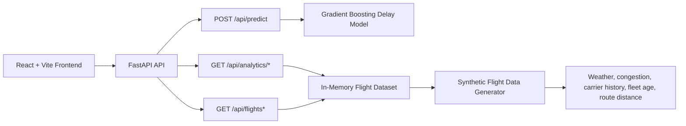

# SkyMind AI Architecture

## System view

SkyMind AI is a single full-stack system where the React frontend, FastAPI backend, and ML model are already integrated and run together locally.

## Runtime flow

1. Backend startup calls `generate_dataset()` in [backend/data_generator.py](</C:/Users/9esun/OneDrive/Desktop/skymind ai/backend/data_generator.py>).
2. A 10,000-row airline network dataset is created with realistic airports, airlines, and engineered operational signals.
3. `train_model()` in [backend/model.py](</C:/Users/9esun/OneDrive/Desktop/skymind ai/backend/model.py>) trains a `GradientBoostingClassifier`.
4. The trained model and dataset are stored in shared in-memory app state.
5. The frontend fetches analytics, flight options, and predictions from FastAPI through [frontend/src/api/client.ts](</C:/Users/9esun/OneDrive/Desktop/skymind ai/frontend/src/api/client.ts>).

## Frontend structure

- [frontend/src/App.tsx](</C:/Users/9esun/OneDrive/Desktop/skymind ai/frontend/src/App.tsx>)
  - route shell and page transitions
- [frontend/src/components/Navbar.tsx](</C:/Users/9esun/OneDrive/Desktop/skymind ai/frontend/src/components/Navbar.tsx>)
  - navigation and model status badge
- [frontend/src/pages/DashboardPage.tsx](</C:/Users/9esun/OneDrive/Desktop/skymind ai/frontend/src/pages/DashboardPage.tsx>)
  - executive overview with KPIs and charts
- [frontend/src/pages/PredictPage.tsx](</C:/Users/9esun/OneDrive/Desktop/skymind ai/frontend/src/pages/PredictPage.tsx>)
  - live prediction console
- [frontend/src/pages/AnalyticsPage.tsx](</C:/Users/9esun/OneDrive/Desktop/skymind ai/frontend/src/pages/AnalyticsPage.tsx>)
  - deeper trend analysis
- [frontend/src/pages/FlightsPage.tsx](</C:/Users/9esun/OneDrive/Desktop/skymind ai/frontend/src/pages/FlightsPage.tsx>)
  - searchable flight manifest

## Backend structure

- [backend/main.py](</C:/Users/9esun/OneDrive/Desktop/skymind ai/backend/main.py>)
  - app bootstrap, CORS, lifespan startup
- [backend/routes/predict.py](</C:/Users/9esun/OneDrive/Desktop/skymind ai/backend/routes/predict.py>)
  - prediction endpoint
- [backend/routes/analytics.py](</C:/Users/9esun/OneDrive/Desktop/skymind ai/backend/routes/analytics.py>)
  - analytics endpoints
- [backend/routes/flights.py](</C:/Users/9esun/OneDrive/Desktop/skymind ai/backend/routes/flights.py>)
  - flight listing and options endpoints
- [backend/state.py](</C:/Users/9esun/OneDrive/Desktop/skymind ai/backend/state.py>)
  - shared app state

## Model features

The model uses these features:

- `day_of_week`
- `month`
- `departure_hour`
- `carrier_delay_history`
- `weather_score`
- `airport_congestion`
- `aircraft_age_years`
- `distance_miles`

The public request contract stays simple, while the backend derives carrier delay history internally from airline and schedule context before inference.

## Design notes

- Theme direction: dark aerospace control room
- Data flow: all charts and tables use backend API responses
- No placeholder prediction values: factor breakdown, confidence, and explanation are generated from live model output
- Local development: Vite proxies `/api` and `/health` to FastAPI on port `8000`
